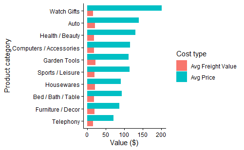
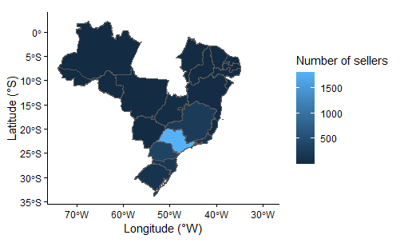
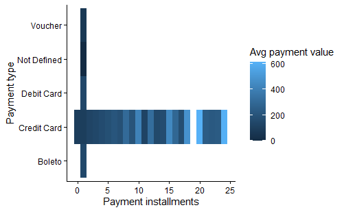
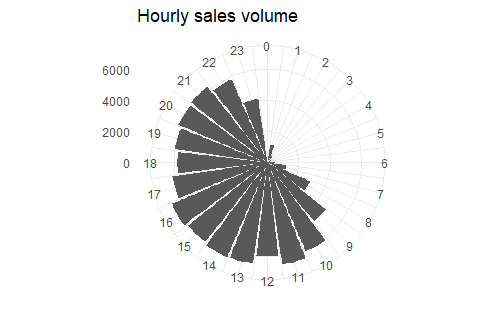
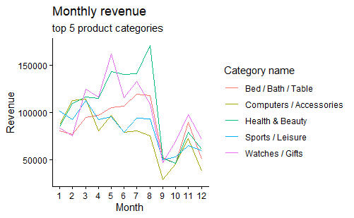
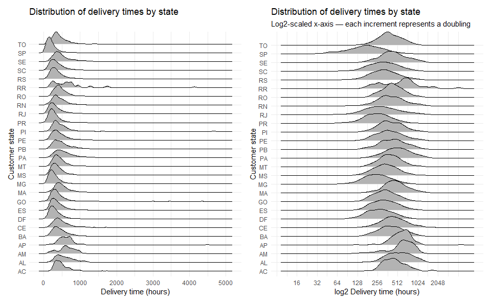
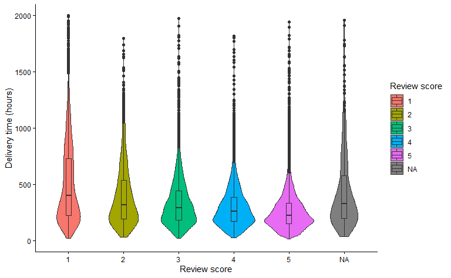
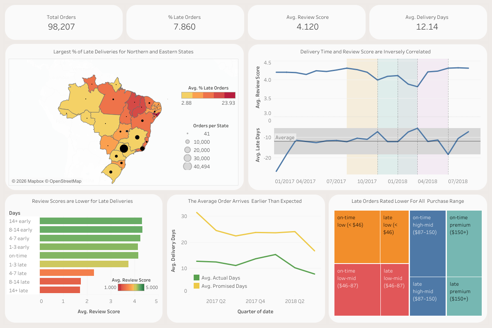

# Brazilian Commerce: End-to-End Data Analysis

An end-to-end analysis of the [Olist Brazilian E-Commerce dataset](https://www.kaggle.com/datasets/olistbr/brazilian-ecommerce), covering data cleaning, exploratory analysis, SQL querying, and interactive Tableau dashboards.

------------------------------------------------------------------------

## Project Structure

```         
├── Csvs/
│   ├── Raw/                              Original CSVs from Kaggle
├── R/
│   ├── 1- bc_1-PKs and SQL export.Rmd    PK determined and CSVs exported PostgreSQL
│   ├── 2- bc_2-Structures check.Rmd      Structure and redundancy checks
├── Normalized data model/
    ├── 3- normalised_model_code.txt      dbdiagram.io code for normalised model
│   ├── 4- normalised_model_code.png      Picture of normalised model
│   └── 5-EDA.Rmd                         EDA using the normalised schema
├── Analytic data model/
|   ├── 5-analytic_schema_code.txt        dbdiagram.io code for analytic model
│   ├── 5-analytic data model.png         Picture of analytic data model 
├── SQL/
│   ├── 6-analysis.sql                    Business question queries
│   └── 7-tableau_prep.sql                Queried tables exported for Tableau
├── Tableau/                              Packaged workbook (.twbx)
└── README.md
```

------------------------------------------------------------------------

## Pipeline Overview

### 1. Key Determination & Initial Export (`R/bc_1-PKs and SQL export.Rmd`)

Raw CSVs are loaded and each table is inspected to identify primary and composite keys. Verified tables are exported to a local PostgreSQL database via DBI connector. The keys identified here inform the normalised schema built in step 3.

### 2. Structure & Redundancy Checks (`R/bc_2-Structures check.Rmd`)

Each table is checked for missingness, duplicates, and join behaviour to ensure no unintended many-to-many relationships arise during later SQL analysis.

Key findings:

\- `geolocation` contained **\~130,000** duplicate rows

\- `orders` date missingness is largely explained by cancelled orders

\- The reliable analysis window was identified as **2017-01-22 to 2018-08-26**, outside of which order volumes are too sparse for stable inference

\- **610** products had no seller listing details filled in

### 3. Normalised Data Model (`R/normalised_model_code.txt`)

A normalised relational data model is constructed in dbdiagram.io using the keys from step 1.

### 4. Normalised Data Model (`R/normalised_model_code.png`)

This image helped us do some EDA by being able to see the tables to be joined.


### 5. Exploratory Analysis & Visualisation (`R/EDA.Rmd`)

Business questions are answered visually in R using the normalised model, taking advantage of R's finer plotting control relative to Tableau. We gave interpretations for each of these figures in the `EDA.Rmd` file.

**Analyses include**:

\- Average price vs freight value by product category



\- Seller density by state (choropleth map)



\- Payment value heatmap by type and installment count



\- Hourly sales volume (polar chart)



\- Monthly revenue for the top 5 product categories



\- Delivery time distributions by state (ridge plot)



\- Review score vs delivery time (violin + boxplot)



Multi-table joins for seller-level analysis became unwieldy in R; this work was moved to SQL.

### 6. Analytic Model (`SQL/analytic_model.sql`)

A denormalised analytic model is created in PostgreSQL (after exploring the Kimball group's data warehousing methods) to overcome the join complexity of the normalised schema during SQL analysis. This wide, query-friendly structure underpins all subsequent SQL work.


### 7. SQL Analysis (`SQL/analysis.sql`)

Business questions are answered in SQL using the analytic model, across three levels of complexity. For brevity's sake, we didn't include any code or images of the SQL analysis here:

**Customer experience**

\- Late delivery rate and average review score by state

\- Relationship between order value and review score

\- What is the most common payment method for orders above the average order value?

**Seller performance**

\- Delivery time buckets (fast/medium/slow) and their effect on satisfaction

\- Top 3 sellers per state by revenue

\- High volume, low-quality sellers (above-average revenue, below-average score)

**Operational trends**

\- Freight-to-price ratio and review score by product category

\- Monthly cumulative revenue (running total)

\- Sellers with declining monthly revenue (3-month rolling average)

### 8. Tableau Preparation (`SQL/tableau_prep.sql`)

Since Tableau Public does not support a live database connection, analytic results are queried as tables first, then exported to CSV. These CSVs are stored in `Csvs/Tableau/`.

I made another **7 SQL** queries to prep the dashboard tables. This makes a total of **15 SQL** queries for the project.

### 9. Tableau Dashboards

Built one main dashboard from the exported CSVs.



[Some Key findings]{.underline}:

\- Average delivery time is **12.13 ± 9.52 days**

\- Late orders average a review score of **2.3** vs **4.3** for on-time orders

\- **Northern** and **Eastern** regions of Brazil have **high average % late deliveries**. As one travels South and East, delivery time decreases

\- **Orders arrive earlier than promised on average**: actual delivery days track consistently below promised delivery days **across the full 2017-2018 period**, and both have trended downward over time

\-**Late deliveries** are typically **penalized as an increasing function of their lateness**. Early deliveries are rewarded equally to on-time deliveries or potentially slightly higher

-Lateness penalty on review scores holds uniformly across all price ranges, suggesting **customer dissatisfaction is not specific to budget** or premium purchases.

### **Database**

**Source:** [Olist Brazilian E-Commerce Public Dataset](https://www.kaggle.com/datasets/olistbr/brazilian-ecommerce) via Kaggle

**Tables:** customers, geolocation, order_items, order_payments, order_reviews, orders, products, sellers, product_category_name_translation

**Period:** September 2016 – October 2018 (stable window: January 2017 – August 2018)

**Scale:** \~100,000 orders, \~3,000 sellers, \~33,000 products

------------------------------------------------------------------------

## Tools

| Stage                         | Tool                                        |
|------------------------------------|------------------------------------|
| Key determination & export    | R (tidyverse, DBI, RPostgres)               |
| Normalised model              | R + dbdiagram.io                            |
| Cleaning & EDA                | R (tidyverse, DataExplorer, naniar, ggplot) |
| Analytic model & SQL analysis | PostgreSQL + dbdiagram.io                   |
| Dashboards                    | Tableau Public                              |
